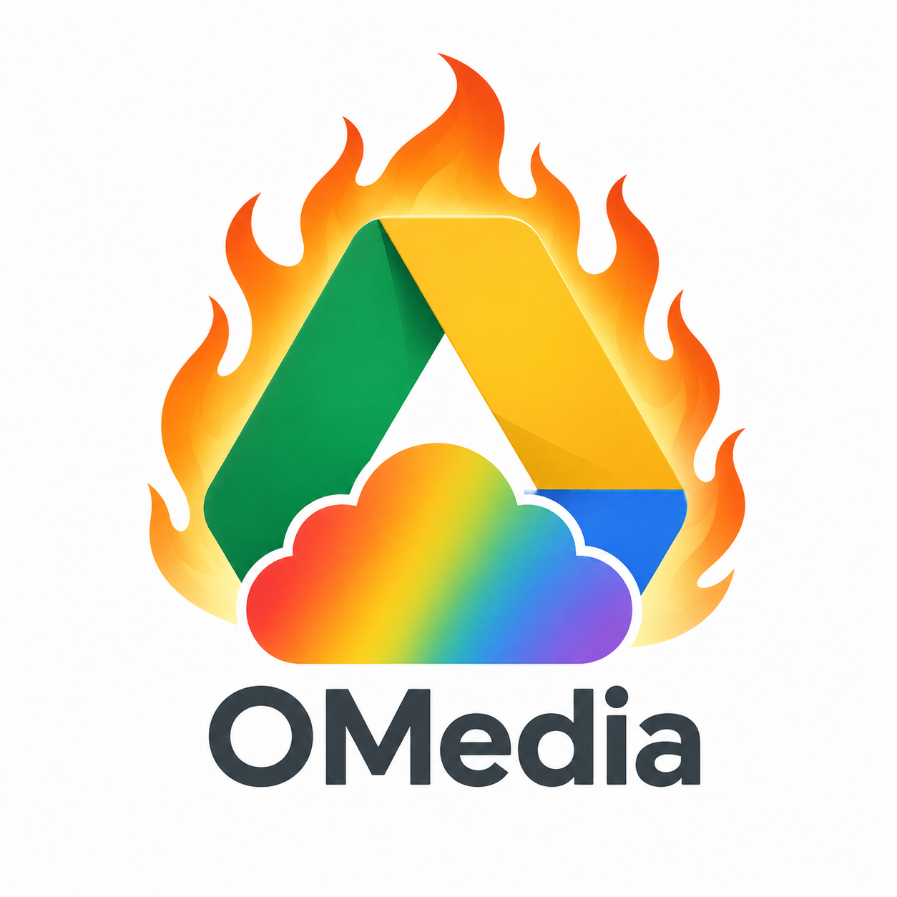

# OMedia


OMedia is a lightweight self-hosted cloud storage project built with Python and FastAPI. It is designed for homelabbing, learning, and experimenting with personal cloud-style storage on a local machine or private server.

## Features
- User registration and login
- Password-based access for regular users
- Admin dashboard for managing users and viewing their files
- Per-user filesystem storage under the data directory
- Folder creation, file upload, download, listing, and deletion
- Simple web interface for browsing and managing files

## Project structure
- server/server.py: FastAPI application and storage logic
- server/root/: frontend pages and static assets
- server/data/: per-user storage and SQLite database
- server/config.json: host, port, SSL, and admin settings

## Requirements
- Python 3.10+
- FastAPI
- Uvicorn
- aiosqlite

## Setup
```bash
python -mvenv .venv
source .venv/bin/activate
cd server
pip install -r requirements.txt
python server.py init
python server.py
```

## Configuration
Example config.json:
```json
{
  "host": "0.0.0.0",
  "port": 443,
  "ssl": {
    "use": true,
    "keyfile": "./key.pem",
    "certfile": "./cert.pem"
  },
  "admin_password": "admin"
}
```

## Storage model
Each user gets their own directory under the data folder, for example:
```text
data/
  user1/
    docs/
      note.html
    file.bin
  user2/
    report.docx
  database.db
```

## Web interface
- /login.html: user login
- /new_user.html: create a new account
- /userdashboard.html: user file manager
- /admin.html: admin dashboard

## API highlights
- /api/login
- /api/logout
- /api/me
- /api/create_user
- /api/lsdir/{username}
- /api/lsfile/{username}
- /api/mkdir/{username}
- /api/rmdir/{username}
- /api/upload/{username}
- /api/download/{username}/{path}
- /api/content/{username}/{path}
- /api/delete/{username}/{path}
- /api/move/{username}
- /api/admin/users
- /api/admin/files/{username}
- /api/admin/users/{username}

## License
This project is licensed under the GNU General Public License v3.0.

## Contribution
You are welcome to fork, modify, and contribute to this project.